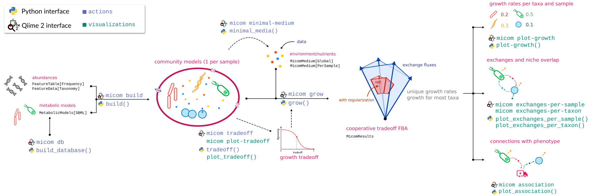

[](https://codecov.io/gh/micom-dev/q2-micom)
[](https://badge.fury.io/py/q2-micom)


A Qiime 2 plugin for MICOM.

## Installation

*This will become easier soon.*

### Setup Qiime 2

You will need a Qiime 2 environment with version `2020.2` or higher ([how to install Qiime 2](https://docs.qiime2.org/2020.2/install/native/#install-qiime-2-within-a-conda-environment)). For instance on Linux you would use:

```bash
wget https://data.qiime2.org/distro/core/qiime2-2020.2-py36-linux-conda.yml
conda env create -n qiime2-2020.2 --file qiime2-2020.2-py36-linux-conda.yml
# OPTIONAL CLEANUP
rm qiime2-2020.2-py36-linux-conda.yml
```

Once installed, activate your Qiime 2 environment:

```bash
conda activate qiime2-2020.2
```

Install dependencies for `q2-micom` from conda:

```bash
conda install -c conda-forge -c \
    bioconda cobra umap-learn jinja2 loky pyarrow loguru tqdm
```

Install `q2-micom` (this will install `MICOM` as well).

```bash
pip install q2-micom
```

### Install a QP solver

**CPLEX**

After registering and downloading the CPLEX studio for your OS unpack it (by running the provided installer) to a directory of your choice (we will assume it's called `ibm`).

Now install the CPLEX python package:

```bash
pip install ibm/cplex/python/3.6/x86-64_linux
```

Substitute `x86-64_linux` with the folder corresponding to your system (there will only be one subfolder in that directory).

**Gurobi**

Gurobi can be installed with conda.

```bash
conda install -c gurobi gurobi
```

You will now have to register the installation using your license key.

```bash
grbgetkey YOUR-LICENSE-KEY
```

### Finish your installation

If you installed `q2-micom` in an already existing Qiime 2 environment, update the plugin cache:

```bash
conda activate qiime2-2020.2  # or whatever you called your environment
qiime dev refresh-cache
```

You are now ready to run `q2-micom`!

## Usage

Here is a graphical overview of a `q2-micom` analysis.



The best way to get started is to work through the [community tutorial](https://github.com/micom-dev/q2-micom/blob/master/docs/README.md).

## References

MICOM: Metagenome-Scale Modeling To Infer Metabolic Interactions in the Gut Microbiota <br>
Christian Diener, Sean M. Gibbons, Osbaldo Resendis-Antonio <br>
mSystems 5:e00606-19 <br>
https://doi.org/10.1128/mSystems.00606-19
