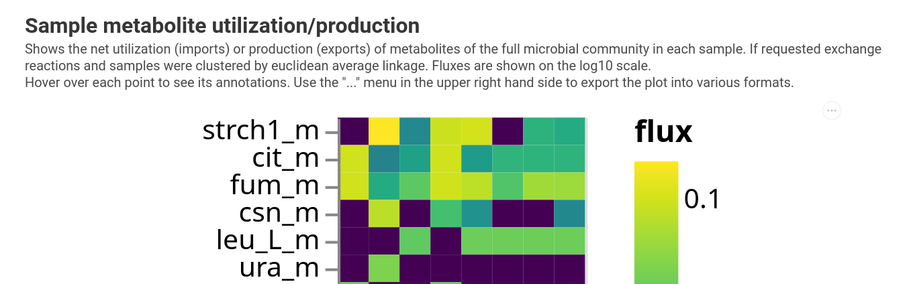

# Community Tutorial

`q2-micom` provides a Qiime 2 plugin for the [MICOM](https://github.com/micom-dev/micom)
Python package and allows for functional analysis of microbial communities using metabolic modeling.

## Getting Help

For any remaining questions you can use the following help channels:

**🔍 QIIME 2 Forum - community plugin support**<br>
https://forum.qiime2.org/c/community-plugin-support/><br>
For all questions regarding usage, methods and strategies here.

**💬 Gitter**<br>
https://gitter.im/opencobra/cobrapy<br>
If you want to chat about q2-micom you can do so on the COBRApy gitter chat by pinging @cdiener.

## A primer on MICOM

### Why metabolic modeling?

Analysis of function in microbial communities is often performed based solely on sequencing data and reference genomes. This is a good way to gauge the metabolic *potential* of a microbiome, but the mere presence
of a particular gene does not guarantee a particular metabolic output. For instance, the same *E. coli* cell can grow either aerobically or anaerobically. However, it will consume and produce very different sets of
metabolites in these two environmental settings.

Metabolic modeling tries to estimate the activity of biochemical networks by predicting metabolic fluxes (i.e. the rates of mass conversions within a cell, usually expressed in mmol per gram dry-weight per hour). It uses
the *genotype* and *environmental conditions* to establish stoichiometry and flux limits
for all biochemical reactions within a particular cell and then tries to find sets of fluxes that yield maximum growth under a set of assumptions. This optimization of biomass production under a given stoichiometry is called
[*Flux Balance Analysis (FBA)*](https://www.nature.com/articles/nbt.1614).

### The assumptions we make

MICOM extends the concept of FBA beyond a single genotype to entire microbial communities. In particular, it tries to reduce the space of feasible fluxes by imposing a tradeoff between optimization of community-wide biomass production and the individual ("selfish") maximization of biomass production for each taxon. To do so, MICOM makes the following assumptions:

1. The biochemical system is in [*steady state*](https://en.wikipedia.org/wiki/Steady_state), which means that fluxes and growth rates are approximately constant in time (i.e. exponential growth balanced by dilution, similar to conditions in a chemostat).
2. All individual taxa strive to maximize their growth.
3. There are thermodynamic limits to biochemical reactions (reaction fluxes have upper and/or lower limits).
4. The metabolic capacities of the bacteria in your sample are approximately the same as those represented in reference/model genomes.

Not all of these assumptions may be fulfilled by the system you are studying. The farther you are from fulfilling them, the less accurate predictions by MICOM are likely to be. A complete discussion of the assumptions and logic underlying MICOM can be found at \[[1](https://doi.org/10.1128/msystems.00606-19)\] and \[[2](https://doi.org/10.1128/msystems.01270-22)\].

## Installation

MICOM models all biochemical reactions in all taxa, which means that the optimization problem MICOM solves included hundreds of thousands of variables. There are only a few numerical solvers that can solve quadratic programming problems of that scale. As of 2023 MICOM comes with a custom open-source hybrid solver that is able to solve large scale linear and quadratic programming problems. This solver is accurate but not the fastest. Faster computation can be achieved by installing a proprietary solver. Right, now we support [CPLEX](https://www.ibm.com/analytics/cplex-optimizer) or [Gurobi](https://www.gurobi.com/), which both have free academic licenses. If you have one of the two solvers mentioned above, you can install `q2-micom` using the following steps.

### Setup Qiime 2

You will need a Qiime 2 environment with version `2021.2` or higher ([how to install Qiime 2](https://docs.qiime2.org/2024.2/install/native/#install-qiime-2-within-a-conda-environment)).

Once installed, we also download the environment for q2-micom and install it into the
QIIME 2 environment we just created. Substitute `qiime2-2024.2` with the name of your Qiime2 environment throughout
this tutorial. Similar to the default Qiime2 installation you will then install an additional environment
file depending on your operating system. Here we are assuming you are using Linux but if you use MacOS just
replace `q2-micom-linux.yml` with `q2-micom-osx.yml` in the download link and file name.

```bash
wget https://raw.githubusercontent.com/micom-dev/q2-micom/main/q2-micom-linux.yml
conda env update -n qiime2-2024.2 -f q2-micom-linux.yml
# OPTIONAL CLEANUP
rm q2-micom-*.yml
```

Finally, you activate your environment.


```bash
conda activate qiime2-2024.2
```

You can now optionally install a proprietary solver if you'd like.

### Install an additional solver (optional)

*CPLEX*

*QIIME 2 versions before 2021.4 are only compatible with CPLEX 12.10 or earlier (later version require at least Python 3.7).*

After registering and downloading the CPLEX studio for your OS unpack it (by running the provided installer) to a directory of your choice (we will assume it's called `ibm`).

Now install the CPLEX python package into your activated environment:

```bash
pip install ibm/cplex/python/3.8/x86-64_linux
```

Substitute `3.8` with the Python version in your QIIME 2 environment, `3.6` for QIIME 2 up to 2021.2 and `3.8` for QIIME 2 2021.4 and newer.
Substitute `x86-64_linux` with the folder corresponding to your system (there will only be one subfolder in that directory).

***Gurobi***

Gurobi can be installed with conda.

```bash
conda install -c gurobi gurobi
```

You will now have to register the installation using your license key.

```bash
grbgetkey YOUR-LICENSE-KEY
```

You are now ready to run `q2-micom`!

## Tutorial: analyzing colorectal cancer data with q2-micom

Below is a graphical overview of a `q2-micom` analysis.


To start, we will need taxon abundances and a model database. Let's look at model databases first.

### Metabolic model databases

To build metabolic community models, you will first need taxon-specific metabolic models for as many taxa in your sample as possible. Unfortunately, there is no magic involved here and we will need to provide this. Building high quality metabolic models is in art in and of itself. It can be done from from a genome alone (for instance using [ModelSEED](http://modelseed.org/) or [CarveME](https://github.com/cdanielmachado/carveme)) but usually requires additional curation. Furthermore, MICOM requires these models to be collapsed to the specific taxonomic rank you want to simulate (e.g. species or genus level). To facilitate this step we provide pre-built databases based on various model collections, ranging from manually curated metabolic models to large automatically reconstructed databases.

-> **[MICOM model database](https://zenodo.org/records/7739096)**

For this tutorial, we will use models summarized at the genus level, as this is usually the lowest rank with decent annotation accuracy in 16S data.

On thing to note is that models are identified by their specific taxonomic name (for instance the genus name). So to match your organisms against
the model database you will see the best results if the used taxonomy (for instance NCBI taxonomy, GTDB, SILVA) for models and your data
is the same. Our model database support RefSeqs or GTDB so we recommend you classify taxa with any of those two. The databases are named after the used naming scheme. We will use data classified with the NCBI taxonomy (RefSeq taxa) so we will download a database of manually curated models using this scheme.

**Download:**

- [AGORA 1.03 genus model DB](https://zenodo.org/records/7739096/files/agora103_refseq216_genus_1.qza?download=1)

### Building community models

The first artifacts you will want to produce are the metabolic community models. These are sample-specific metabolic models that contain all taxa in a sample (i.e. all taxa represented in AGORA) at the correct relative abundance (i.e. as inferred from the 16S or metagenomic sequencing data). To build these models, you will need the relative abundance and taxonomic annotation for each sequence variant in your sample. Luckily, one of the main function of Qiime 2 is to obtain these features from your sequencing data ...phew.

For the purposes of this tutorial, we will provide pre-built artifacts for a 16S amplicon sequencing data set from healthy donors and individuals with recurrent *C. difficile* infection. Those files were taken from the [ISB Microbiome course 2023](https//isbscience.org/microbiome2023), so feel free to check out
the course to learn more about the samples and how they were processed. These artifacts were generated using DADA2 and the taxonomy was inferred using the NCBI
Refseq database.

**Downloads**:

- [abundance table](https://github.com/micom-dev/q2-micom/raw/main/docs/cdi_table.qza)
- [taxonomy](https://github.com/micom-dev/q2-micom/raw/main/docs/cdi_taxa.qza)

Using our pre-baked model database, we can now build our community models with the `qiime micom build` command. Note that most commands in `q2-micom` take a `--p-threads` parameter that specifies how many CPU cores to use. Using multiple threads will speed things up considerably. Additionally, using the `--verbose` flag will usually show a progress bar. Finally, low abundance taxa are usually dropped from the models to improve computational efficiency. This abundance cutoff is controlled by the `--p-cutoff` parameter, which is set to 0.01% by default. Okay, let's build our community models:

```bash
qiime micom build --i-abundance cdi_table.qza \
                  --i-taxonomy cdi_taxa.qza \
                  --i-models agora103_refseq216_genus_1.qza \
                  --p-cutoff 0.0001 \
                  --p-threads 4 \
                  --o-community-models models.qza \
                  --verbose
```

This will give you something like this:

```
Merging with the database using ranks: genus
[16:00:08] WARNING  Less than 50% of the abundance could be matched to the model database. Model `ERR1883294` may not be   community.py:229
                    representative of the sample
Running ━━━━━━━━━━━━━━━━━━━━━━━━━━━━━━━━━━━━━━━━ 100% 0:02:56
Each community model contains 10-42 taxa (average 26+-11).
Community models cover 49.46%-99.91% of the total abundance (average 88.00%+-17.00%).
Saved CommunityModels[Pickle] to: models.qza
```

 Building the community models will take a while, but this usually only needs to be done once for each sample. You can then run many growth simulations for a given sample using the existing model. You see a warning here that one sample does not match well to the database. This is usually a good point to choose a larger database. Here we
 will continue since we are close to 50% for that sample and this is meant as an example ;)

### Running a growth simulation

Now that we have our community models, let's simulate growth. For this we will need information about the environment, because growth rates will depend strongly on available nutrients. In contrast to classical growth media in the lab, growth conditions in metabolic modeling have to be provided in terms of fluxes and not concentrations. Fluxomics or time course metabolomics data can be used to parameterize the growth environment, but these data are almost never available. Alternatively, you might estimate a minimal medium using the 'omics data itself (more about that further down below). Usually, however, we estimate these parameters based what is known *a priori* about the nutrient environment. For example, there are existing estimates for a number of common diets in the [MICOM media repository](https://github.com/micom-dev/media). We will use a medium based on European diet, with a MICOM-specific manual depletion of metabolites that are commonly absorbed in the small intestine.

Similar to the taxonomy naming schemes are important again. However, this time we need to match the metabolite names. Many of the model databases use different naming schemes for individual metabolites and you will need to match the medium to the database. In this case we used
the AGORA database for the models, so we will download the medium for AGORA.

**Download**:

- [growth conditions for human gut](https://github.com/micom-dev/media/raw/main/media/western_diet_gut_agora.qza)

Additionally, you will have to provide a parameter value that represents
the tradeoff between maximal community growth and individual taxon growth. For now we will set this to 0.5 and have a better look at this parameter in the next section. Let's dive in and simulate growth!

```bash
qiime micom grow --i-models models.qza \
                 --i-medium western_diet_gut_agora.qza \
                 --p-tradeoff 0.5 \
                 --p-threads 4 \
                 --o-results growth.qza \
                 --verbose
```

You will again see a progress bar and will have the results when everything is done (for me, this took about 9m with 4 threads).

We can now start to look at growth rates and fluxes in our models, but we will first come back to our tradeoff parameter...

### Picking a tradeoff value

One feature specific to MICOM is the tradeoff between community growth rate and individual taxon growth rates. Here, MICOM applies "pressure" to the model to allow growth for as many taxa as possible. However, this dual optimization problem results in tug-of-war between high community-level biomass production vs. allowing individual taxa to grow. The balance between the two is dictated by a *tradeoff* value which dictates what percentage of the maximal community growth rate can be reached, which ranges from 0 (no growth enforced) to 1 (enforce maximum community growth). A more detailed description and ecological interpretation of what MICOM does [can be found here](https://journals.asm.org/doi/10.1128/msystems.01270-22).

The truth usually lies in the middle of these extremes, and in [our study](https://msystems.asm.org/content/5/1/e00606-19) we found that a tradeoff of 0.5 seemed to correspond best to *in vivo* replication rates. However, the best tradeoff may also depend on your samples, environment, and taxonomic rank used to build the models. So it is always a good idea to run a validation step. The following command will run the growth simulation with many different tradeoff values and track some key metrics.

```bash
qiime micom tradeoff --i-models models.qza \
                     --i-medium western_diet_gut_agora.qza \
                     --p-threads 4 \
                     --o-results tradeoff.qza \
                     --verbose
```

After this analysis is finished we can take a look at our first visualization, for instance by opening it in https://view.qiime2.org .

```bash
qiime micom plot-tradeoff --i-results tradeoff.qza \
                          --o-visualization tradeoff.qzv
```

This will give you the following:


Here the distribution of growth rates is shown by the 2D histogram on the left and the fraction of growing taxa with its mean line is shown on the right. You can see that lowering the tradeoff gives you more and more taxa that grow. The elbow is around 0.5 - 0.7, but we might want to pick a value as high as 0.6 here because that is where we observe the largest jump. Due to the constant dilution rate in the gut system, we expect most of the taxa at appreciable relative abundances should have a positive growth rate. We use this assumption to tune the tradeoff parameter. Another way to validate model growth rates, if you are working with shotgun metagenomic data, is to compare them against [independently-estimated replication rates](https://www.ncbi.nlm.nih.gov/pmc/articles/PMC5087275/). Alternatively, non-growth could also be due to a breakdown between MICOM and reality (e.g. incorrect dietary parameterization or gaps in the genome-scale metabolic models that do not accurately represent the activity of the strains that are in your sample).

Okay, now that we understand where the tradeoff value comes from we can come back to our growth simulations.

### Visualizing growth rates

The `MicomResults` artifact we generated earlier can be visualized in many different ways. The first thing we might want to have a look at are the growth rates themselves.

```bash
qiime micom plot-growth --i-results growth.qza \
                        --o-visualization growth_rates.qzv
```


We can see that growth rates are pretty heterogeneous across samples, but it's still hard to see what is going on.

### Visualizing metabolite consumption

Now let's have a look at consumption of metabolites. Depending on the community composition, we should see varying preferences for consumption/production of certain metabolites and it would be interesting to see how these fluxes line up with our phenotype. In general, even for a given growth rate, these fluxes are not unique. For instance, if *E. coli* needs 10 mmol of glucose per hour to grow it may still import 100mmol per hour and just not use the remaining 90, or import 80 and not use the remaining 70, etc. To make those imports more unique MICOM will report the minimal consumption rates that still provide the observed growth rates (i.e. 10 mmol/h for our *E. coli* example).

```bash
qiime micom exchanges-per-sample --i-results growth.qza \
                                 --o-visualization exchanges.qzv
```



We do see that there is some separation between healthy and cancer samples in the consumption of certain metabolites. For instance, isoleucin is only ever consumed in 3 of the 4 pre-FMT samples but none of the others.

We could also look at production of metabolites by passing the `--p-direction export` parameter, but due to the enforced minimum import there is usually very little net production of metabolites. So this is only useful if you want to look at overshoot production.

### Visualizing growth niches

The last visualization gave us a global view of metabolite consumption but we may also be interested in looking at consumption preferences for individual taxa. We will need to lower the complexity of these data, as it is impossible to visualize imports for each metaboliote within each taxon in each sample. One useful way to simplify this visualization is to first reduce dimensions on the metabolite axis with UMAP and represent metabolite imports as a single point in a 2D space. Then we can plot each taxon in each specific samples onto that 2D space. Taxa that are close to each other occupy a similar growth niche, whereas taxa that are far away from each other are dissimilar in thier growth requirements.

```bash
qiime micom exchanges-per-taxon --i-results growth.qza \
                                --o-visualization niche.qzv
```


Most taxa have a specific growth niche, which varies slightly from sample to sample. Though inspecting the plot you will be able to find out that Bacteroides
and Phocaeicola have very different niches in pre- versus post-FMT communities indicating that their metabolic behavior does shift a lot during FMT.


You can tune the UMAP reduction by using the parameters `--p-n-neighbors` and `--p-min-dist`. You can look at metabolite production with `--p-direction export` where you can observe weaker clustering, suggesting that there is considerably more overlap across taxa in metabolite production.

### Associating fluxes with a host phenotype

A common question is whether there is a connection between a host phenotype of interest and the fluxes estimated by MICOM. However, not all exchange fluxes will be informative for this question. The most predictive type of flux for a phenotype of interest is usually the overall production flux, which is the total rate of production of a metabolite *without* considering its consumption by taxa in the community. For instance if all bacteria produce 100 mmol/gDW/h of ethanol but other taxa also consume 90 mmol/gDW/h of ethanol, the overall production flux would still be 100 mmol/gDW/h. Why is that production flux important? So far, MICOM only models microbial communities, without including cells from other Domains of life (e.g. Eukarya) that may be present in the environment. But host-associated bacteria compete with eukaryotic cells for metabolites, like intestinal cells in the gut or plant root cells in soil. These other cell types will consume a fraction of all metabolites in the environment and thus will take up metabolites from this total production pool.

Overall production fluxes are the default set of fluxes used by q2-micom. MICOM also allows for the analysis of minimal import fluxes shown in `qiime micom exchanges-per-sample`, but these are often not very informative.

To predict a phenotype from fluxes we will use the `fit-phenotype` command. Here you will need a Qiime 2 [Metadata file](https://docs.qiime2.org/2024.2/tutorials/metadata/) that specifies your phenotype of interest. Our metadata is pretty simple and just assigns a healthy or cancer status to each sample.

**Download:**

[Metadata file](https://github.com/Gibbons-Lab/isb_course_2023/raw/main/data/metadata.tsv)

`q2-micom` supports binary or continuous phenotype data.

```bash
qiime micom association --i-results growth.qza \
                        --p-fdr-threshold 0.3 \
                        --m-metadata-file metadata.tsv \
                        --m-metadata-column disease_state \
                        --o-visualization associations.qzv
```

We could define a continuous phenotype with `--p-variable-type continuous` or look for differences in import fluxes with `--p-flux-type import`.

The visualization now shows which production fluxes are predictive of the phenotype. For this it runs a non-parametric test (Mann Whitney U in this case)
for each metabolite across the phenotype. After correction for multiple testing the visualization will show metabolites with a significance level below
the chosen FDR threshold. The bars will correspond to the magnitude of the difference/correlation. We choose a very large threshold here because we are not
really powered to see the differences. Normally they default of 0.05 is more stringent. We do see that there seems to be a trend for higher TMAO production
in the pre-FMT samles for instance. Furthermore, the FMT status can be predicted perfectly from the fluxes overall.

**Note**: The CSV file containing the tests that can be downloaded from the visualization always contains all tests and ignores the FDR cutoff.

It also runs a LASSO regression predicting the pehnotype from fluxes in a cross-validation scheme. The accuracy or R2 of the regression
can tell you if the phenotype is associated globally with the fluxes.


Basically, the larger the bar, the stronger the effect. In this case, negative coefficients denote fluxes that are higher in rCDI samples and positive coefficients denote fluxes that are higher in healthy samples. You can hover over the bars to see the name of the metabolite and can plot the production fluxes in the lower panel.

Obviously, we would still have to validate these very speculative hypotheses, but at least we get some functional insight starting from 16S data alone (while making several assumptions as detailed above...).

### Estimating a minimal medium

In some cases you may have no information on the environment and thus lack a starting point for parameterizing a growth medium. In this case `q2-micom`, lets you predict a minimal medium based on all importable metabolites in the community models by specifying a minimum growth rate all taxa have to achieve simultaneously.

> Be aware that this does not necessarily correspond to any realistic environment that your microbial community is exposed to!

> [!NOTE]
> This will require you to specify minimum growth rates for the community and/or (some) taxa.

You can also specify exactly what you would want to optimize. For instance, you can minimize the number of media components rather than
flux with the `--p-minimize-components` flag (this will be slow). Or you could rather minimize the uptake of mass or any elements
(such as carbon or nitrogen) with the `--p-weights` options.

As an example let's build a minimal medium for our community with the following specifications:

1. The community grows at a rate of 0.1/h
2. All taxa individually grow at least with a rate of 0.01/h
3. We want the minimum uptake of mass

```bash
qiime micom minimal-medium --i-models models.qza \
                           --p-community-growth 0.1 \
                           --p-growth 0.01 \
                           --p-weights mass \
                           --p-threads 2 \
                           --o-medium minimal_medium.qza \
                           --o-sample-media sample_minimal_media.qza \
                           --o-results media_results.qza \
                           --verbose
```

This will output a combined medium, the minimal media for each single sample, and a
results artifact in case you want to expect the solution with the applied growth constraints.

We can use the Qiime 2 artifact API to inspect the medium:

```python
In [1]: from qiime2 import Artifact

In [2]: import pandas as pd

In [3]: medium = Artifact.load("minimal_medium.qza").view(pd.DataFrame)

In [4]: medium.sort_values(by="flux", ascending=False).head()
Out[4]:
       reaction      flux metabolite
2   EX_MGlcn9_m  0.108333   MGlcn9_m
19      EX_pi_m  0.088816       pi_m
12    EX_hspg_m  0.001911     hspg_m
10  EX_glygn2_m  0.001554   glygn2_m
9      EX_fe3_m  0.001250      fe3_m

In [5]: medium.shape
Out[5]: (27, 3)
```

So, the most 'efficient' medium requires at least 27 different metabolites and seems to be consuming mucin glycans (all of the MGln* metabolites), as well as phosphate, glycogen, and iron.

## Bonus

### Filtering built community models or simulation results

You can create q2-micom artifacts containing only a subset of samples using the `filter-models` and `filter-results` actions. For instance, if we wanted
to create model and results artifacts that contain only the cancer samples we could do the following:

```bash
qiime micom filter-models --i-models models.qza \
                          --m-metadata-file metadata.tsv \
                          --p-query "disease_state == 'healthy'" \
                          --o-filtered-models cancer_built_models.qza
```

and similarly for the results:

```bash
qiime micom filter-results --i-results growth.qza \
                           --m-metadata-file metadata.tsv \
                           --p-query "disease_state == 'healthy'" \
                           --o-filtered-results cancer_results.qza
```

Note that you will need a metadata table either (1) only includes the samples of interest or (2) can be
queried with a [pandas query](https://pandas.pydata.org/docs/reference/api/pandas.DataFrame.query.html)
to select only the samples of interest. You can also add the parameter `--p-exclude` which will
return an artifact covering all samples *except* the ones selected by the metadata and query.

Those can now be passed on to the visualization steps to generate visualizations for only the cancer samples.

### Identifying metabolites

Many of the metabolite IDs returned by MICOM may be hard to identify but will be annotated in most of the visualizations.
You can also export the detailed annotations from the growth results:

```bash
qiime tools export --input-path growth.qza --output-path growth
```

The folder `growth` will now include an `annotations.csv` file that contains the individual annotations.

### Building your own model database

Maybe your sample is not well represented by, for instance, the AGORA models, or you may have better metabolic reconstructions for the taxa in your samples. In that case you may want to build your own database for `q2-micom`. This is pretty simple -- you will need 2 things:

1. A directory that contains your metabolic models in [SBML format](http://sbml.org/Main_Page) with filenames of the form `{ID}.xml`.
2. A Qiime 2 Metadata file annotating each model with at least an id, the file path, and the full taxonomy (kingdom, phylum, class, order, family, genus, species, strain (optional)).

With these two things you can use `qiime micom db` to build your database, summarized to any given taxonomic rank. For instance the AGORA v1.03 artifact was built by downloading the SBML models from https://www.vmh.life/#downloadview and using an adapted [metadata file](https://github.com/micom-dev/databases/blob/main/recipes/agora1/data/agora103_new_taxa.tsv). The genus database was then built using the following command.

```bash
qiime micom db --m-meta-file agora.tsv \
               --p-rank genus \
               --p-threads 4 \
               --o-metabolic-models agora_genus_103.qza
```

The full Nextflow workflows for all provided databases can be found in the MICOM [database repository](https://github.com/micom-dev/databases).

### Getting growth and flux data for additional analyses

Obviously, you may want to perform different statistical tests, visualizations, or analyses on the growth rates or fluxes obtained from `q2-micom`. For this we provide a convenience function in the `q2_micom` module, which returns the data as pandas DataFrames.

```python
In [1]: from q2_micom import read_results

In [2]: res = read_results("growth.qza")

In [3]: res.exchange_fluxes.head()
Out[3]:
    taxon   sample_id  tolerance           reaction      flux  abundance      metabolite direction
0  medium  ERR1883214   0.000001  EX_amylopect900_m -0.000016        NaN  amylopect900_m    import
1  medium  ERR1883214   0.000001         EX_pydxn_m -0.000018        NaN         pydxn_m    import
2  medium  ERR1883214   0.000001      EX_12dgr180_m -0.000043        NaN      12dgr180_m    import
3  medium  ERR1883214   0.000001           EX_co2_m  3.962737        NaN           co2_m    export
4  medium  ERR1883214   0.000001          EX_ptrc_m -0.100000        NaN          ptrc_m    import

In [4]: res.growth_rates.head()
Out[4]:
   abundance  growth_rate  reactions  metabolites                   taxon  tradeoff   sample_id
0   0.821946     0.289004       2274         1386             Akkermansia       0.5  ERR1883214
1   0.000270     0.000201       2808         1732                 Blautia       0.5  ERR1883214
2   0.059597     0.043305       3532         2001             Clostridium       0.5  ERR1883214
3   0.000255     0.000187       2518         1753            Enterococcus       0.5  ERR1883214
4   0.014103     0.010495       2826         1639  Erysipelatoclostridium       0.5  ERR1883214
```
