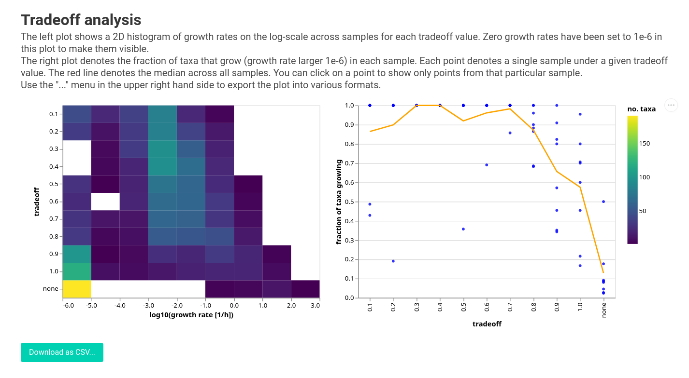
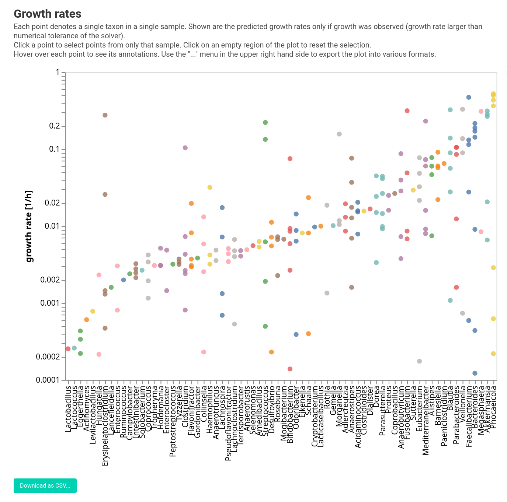
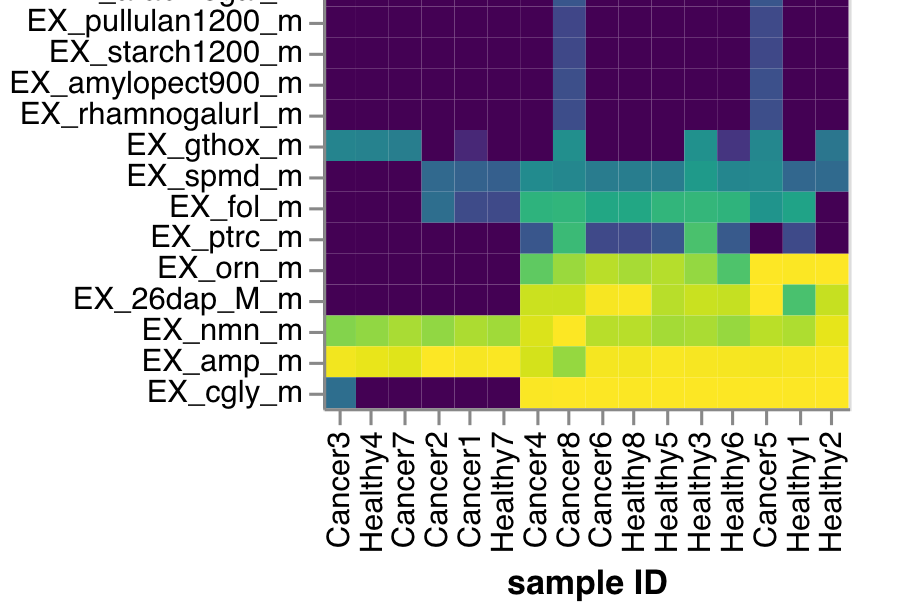
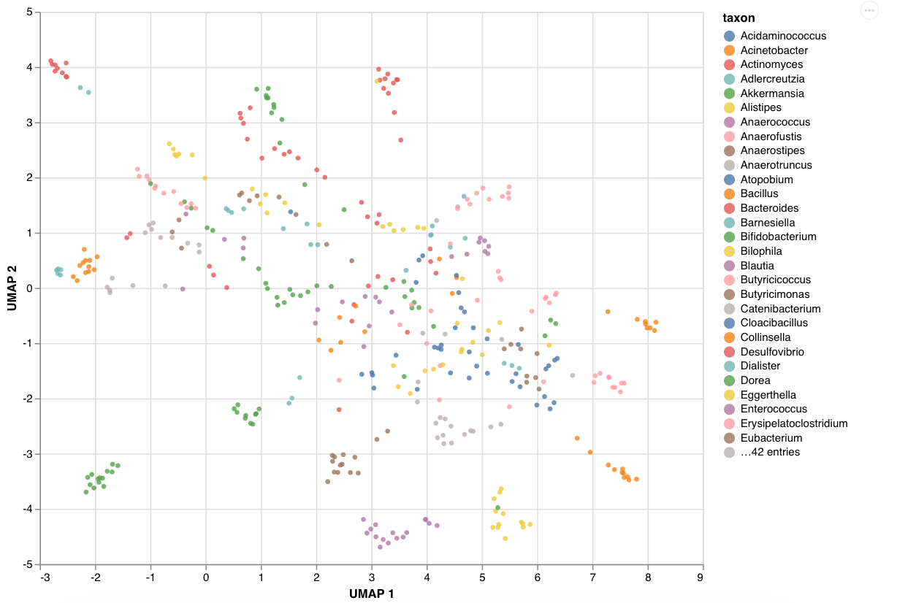
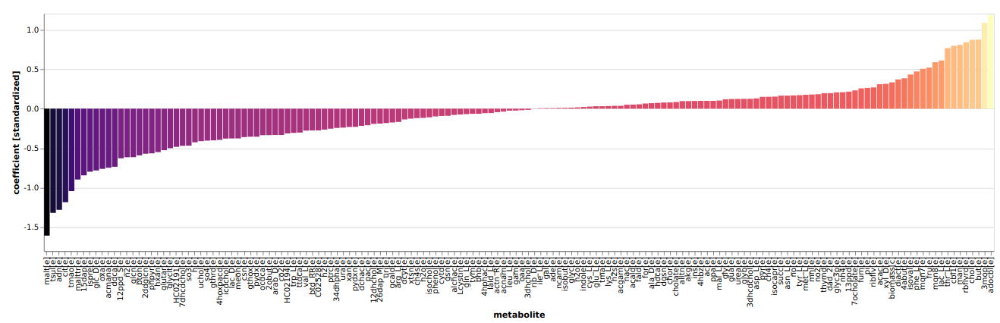

# Community Tutorial

`q2-micom` provides a Qiime 2 plugin for the [MICOM](https://github.com/micom-dev/micom) Python package and allows for functional analysis of
microbial communities using metabolic modeling.

## A primer on MICOM

### Why metabolic modeling?

Analysis of function in microbial communities is often performed based solely on sequencing data and reference genomes. This is a good way to
gauge the metabolic *potential* of a microbe, but the mere presence
of a particular gene does not guarantee a particular metabolic output. For instance, the same *E. coli* cell can grow either aerobically or anaerobically. However, it will consume and produce very different sets of
metabolites in those two environmental settings.

Metabolic modeling tries to estimate the activity of biochemical networks by predicting metabolic fluxes (i.e. the rates of mass conversions within a cell, usually expressed in mmol per gram dry-weight per hour). It uses
the *genotype* and *environmental conditions* to establish stoichiometry and flux limits
for all biochemical reactions within a particular cell type and then tries to find sets of fluxes that yield maximum growth under a set of assumptions. This optimization of biomass production under a given stoichiometry is called
[*Flux Balance Analysis (FBA)*](https://www.nature.com/articles/nbt.1614).

### The assumptions we make

MICOM extends the concept of FBA beyond a single genotype to entire microbial communities. In particular, it tries to reduce the space of feasible fluxes by imposing a tradeoff between optimization of community-wide biomass production and the individual ("selfish") maximization of biomass production for each taxon. To do so, MICOM makes the following assumptions:

1. The biochemical system is in [*steady state*](https://en.wikipedia.org/wiki/Steady_state), which means that fluxes and growth rates are approximately constant in time (i.e. exponential growth balanced by dilution, similar to conditions in a chemostat).
2. All individual taxa strive to maximize their growth.
3. There are thermodynamic limits to biochemical reactions (reaction fluxes have upper and/or lower limits).
4. The metabolic capacities of the bacteria in your sample are approximately the same as those represented in reference/model genomes.

Not all of these assumptions may be fulfilled by the system you are studying. The farther you are from fulfilling them, the less accurate predictions by MICOM are likely to be.

## Installation

MICOM models all biochemical reactions in all taxa, which means that the optimization problem MICOM solves included hundreds of thousands of variables. There are only a few numerical solvers that can sole quadratic programming problems of that scale. Right, now we support [CPLEX](https://www.ibm.com/analytics/cplex-optimizer) or [Gurobi](https://www.gurobi.com/), which both have free academic licenses but will require you to sign up for them. We hope to change this in the future by making MICOM compatible with an open-source solver. If you have one of the two solvers mentioned above, you can install `q2-micom` using the
following steps.

### Setup Qiime 2

You will need a Qiime 2 environment ([how to install Qiime 2](https://dev.qiime2.org/latest/quickstart/#install-qiime-2-within-a-conda-environment)). Once installed, activate the Qiime 2 environment:

```bash
conda activate qiime2-dev
```

Install dependencies for `q2-micom`:

```bash
conda install -c bioconda -c conda-forge cobra umap-learn jinja2 pyarrow tqdm
```

Install `q2-micom` (this will install `MICOM` as well).

```bash
pip install git+https://github.com/micom-dev/q2-micom
```

### Install a QP solver

**CPLEX**

After registering and downloading the CPLEX studio for your OS unpack it (by running the provided installer) to a directory of your choice (we will assume it's called `ibm`).

Now install the CPLEX python package:

```bash
pip install ibm/cplex/python/3.6/x86-64_linux
```

Substitute `x86-64_linux` with the folder corresponding to your system (there will only be one subfolder in that directory).

**Gurobi**

Gurobi can be installed with conda.

```bash
conda install -c gurobi gurobi
```

You will now have to register the installation using your license key.

```bash
grbgetkey YOUR-LICENSE-KEY
```

### Finish your installation

If you installed `q2-micom` in an already existing Qiime 2 environment, update the plugin cache:

```bash
conda activate qiime2-dev  # or whatever you called your environment
qiime dev refresh-cache
```

You are now ready to run `q2-micom`!

## Walkthrough: Analyzing colorectal cancer data with q2-micom

Below is a coarse overview of a `q2-micom` analysis.


To start, we will need taxon abundances and a model database. Let's look at model databases first.

### Metabolic model databases

To build metabolic community models, you will first need taxon-specific metabolic models for as many taxa in your sample as possible. Unfortunately, there is no magic involved here and we will need to provide this. Building high quality metabolic models is in art in itself. It can be done from from a genome alone (for instance using [ModelSEED](http://modelseed.org/) or [CarveME](https://github.com/cdanielmachado/carveme)) but usually requires additional curation. Additionally, MICOM requires those models to be collapsed to the specific taxonomic rank you want to simulate (e.g. species or genus level). To facilitate this step we provide pre-built databases based on the [AGORA](https://doi.org/10.1038/nbt.3703) model collection, which comprises manually curated metabolic models for 818 bacterial strains. For this tutorial, we will use models summarized on the genus level, as this is usually the lowest rank with decent annotation accuracy in 16S data sets.

**Download:**

- [AGORA 1.03 genus model DB](https://zenodo.org/record/3608330/files/agora_genus_103.qza?download=1)

### Building community models

The first artifacts you will want to produce are the metabolic community models. These are sample-specific metabolic models that contain all taxa in that specific sample (i.e. all taxa represented in AGORA) at the correct relative abundance (i.e. as inferred from the 16S or metagenomic sequencing data). To build these models, you will need the relative abundance and taxonomic annotation for each sequence variant in your sample. Luckily, one of the main function of Qiime 2 is to obtain these things from your sequencing data...phew.

For the purposes of this tutorial, we will provide pre-built artifacts for a 16S amplicon sequencing data set from 8 healthy and 8 colorectal cancer stool samples taken from https://doi.org/10.1158/1940-6207.CAPR-14-0129. These artifacts were generated using DADA2 and the taxonomy was inferred using the SILVA database version 132.

**Downloads**:

- [abundance table](crc_table.qza)
- [taxonomy](crc_taxa.qza)

Using our pre-baked model database, we can now build our community models with the `qiime micom build` command. Note that most commands in `q2-micom` take a `--p-threads` parameter that specifies how many CPU cores to use. Using multiple threads will speed things up considerably. Additionally, using the `--verbose` flag will usually show a progress bar. Finally, very low abundance taxa are usually dropped from the models. This abundance cutoff is controlled by the `--p-cutoff` parameter, which is set to 0.01% by default. Okay, let's build our community models:

```bash
qiime micom build --i-abundance crc_table.qza \
                  --i-taxonomy crc_taxa.qza \
                  --i-models agora_genus_103.qza \
                  --p-cutoff 0.0001 \
                  --p-threads 8 \
                  --o-community-models models.qza \
                  --verbose
```

This will give you something like this:

```
Taxa per sample:
count    16.0000
mean     27.0000
std       5.7038
min      17.0000
25%      22.7500
50%      28.0000
75%      30.0000
max      36.0000
Name: sample_id, dtype: float64

 50%|█████████████████████████████████████                                   | 8/16 [09:39<09:39, 72.48s/sample(s)]
```

The first number indicate the number of genera per sample used to build the models. On average, we have 27 (17-36) taxa per sample. Building the community models will take a while, but this usually only needs to be done once for each sample. You can then run many growth simulations for a given sample using the existing model.

### Running a growth simulation

Now that we have our community models, let's simulate growth. For this we will need information about the environment, because growth rates will depend strongly on the available nutrients. In contrast to classical growth media in the lab, growth conditions in metabolic modeling have to be provided in terms of fluxes and not concentrations. Fluxomics or time course metabolomics data can be used to parameterize the growth environment, but these data are almost never available. Alternatively, you could potentially estimate a minimal medium using the 'omics data itself (more about that later). Usually, however, we must estimate these parameters based what is known about the nutrient environment. For example, there are existing estimates for a number of other common diets. These dietary parameterizations were based on European diet data ([Virtual Metabolic Human](https://www.vmh.life/)), with a MICOM-specific manual depletion of metabolites that are commonly absorbed in the small intestine. In this tutorial, we will use the "average Western diet".

**Download**:

- [growth conditions for human gut](https://zenodo.org/record/3608330/files/western_diet_gut.qza?download=1)

Additionally, you will also have to provide a parameter that models
the tradeoff between maximal community growth and individual taxa growth. For now we will set this to 0.3 and have a better look at this parameter in the next section. So let's dive in and simulate growth.

```bash
qiime micom grow --i-models models.qza \
                 --i-medium western_diet_gut.qza \
                 --p-tradeoff 0.3 \
                 --p-threads 8 \
                 --o-results growth.qza \
                 --verbose
```

You will again see a progress bar and will have the results when everything is done (for me, this took about 7m with 8 threads). 

We can now start to look at growth rates and fluxes in our models, but we will first come back to our tradeoff parameters...

### Picking a tradeoff value

One feature specific to MICOM is the consideration of the tradeoff between community growth rate and individual taxon growth rates. Here, MICOM applies "pressure" to the model to allow growth for as many taxa as possible. However, this results in tug-of-war between high community-level biomass production vs. allowing more taxa to grow. The balance between the two is dictated by a *tradeoff* value which dictates what percentage of the maximal community growth rate has to be maintained, which ranges from 0 (no growth) to 1 (enforce maximum community growth).

The truth usually lies in the middle of those extremes, and in our study we found that a tradeoff of 0.5 seemed to correspond best to *in vivo* replication rates. However, the best tradeoff may also depend on your samples, environment, and taxonomic rank used to build the models. So it is a good idea to run a validation. You will only need the same input as for the previous command. The command will now run the growth simulation with many different tradeoff values and track some key metrics.

```bash
qiime micom tradeoff --i-models models.qza \
                     --i-medium western_diet_gut.qza \
                     --p-threads 8 \
                     --o-results tradeoff.qza \
                     --verbose
```

After this analysis is finished we should take a look at our first visualization.

```bash
qiime micom plot-tradeoff --i-results tradeoff.qza \
                          --o-visualization tradeoff.qzv
```

This will give you the following:

<a href="https://micom-dev.github.io/q2-micom/assets/tradeoff/data/index.html" target="_blank"></a>

Here the distribution of growth rates is shown by the 2D histogram on the left and the fraction of growing taxa with its mean line is shown on the left. You can see that lowering the tradeoff gives you more and more taxa that grow. The elbow is around 0.5, but we might want to pick a value as low as 0.3 here because that is where we observe the largest jump. Due to the constant dilution rate in the gut system, we expect most of the taxa observed in the gut at appreciable relative abundances should have a positive growth rate. We use this assumption to tune the tradeoff parameter. Another way to validate model growth rates, if you are working with shotgun metagenomic data, is to compare them against [independently-estimated replication rates](https://www.ncbi.nlm.nih.gov/pmc/articles/PMC5087275/). Alternatively, non-growth could also be due to a breakdown between MICOM and reality (e.g. incorrect dietary parameterization or gaps in the genome-scale metabolic models that do not accurately represent the activity of the strains that are *in situ*).

Okay, now that we understand where the tradeoff value comes from we can come back to our growth simulations.

### Visualizing growth rates

The `MicomResults` artifact we generated earlier can be visualized in many different ways. The first thing we might want to have a look at are the growth rates themselves.

```bash
qiime micom plot-growth --i-results growth.qza \
                        --o-visualization growth_rates.qzv
```

<a href="https://micom-dev.github.io/q2-micom/assets/growth/data/index.html" target="_blank"></a>

We can see that growth rates are pretty heterogeneous across samples but it's still hard to se what is going one.

### Visualizing metabolite consumption

Now let's have a look at consumption of metabolites. Depending on the community composition, we should see varying preferences for consumption/production of certain metabolites and it would be interesting to see how these fluxes line up with our phenotype. In general, even for a given growth rate, these fluxes are not unique. For instance if *E. coli* needs 10 mmol of glucose per hour to grow it may still import 100mmol and just not use the remaining 90, or import 80 and not use the remaining 70, etc. To make those imports more unique MICOM will report the minimal consumption rates that still provide the observed growth rates (so 10 mmol/h for our *E. coli* example).

```bash
qiime micom exchanges-per-sample --i-results growth.qza \
                                 --o-visualization exchanges.qzv
```


<a href="https://micom-dev.github.io/q2-micom/assets/per_sample/data/index.html" target="_blank"></a>

We do see that there is some separation between healthy and cancer samples in the consumption of certain metabolites. For instance, there is a set of amino acids that get consumed by healthy gut microbiota but not so much in the cancer-associated gut microbiota. One of these amino acids is glutamine. Many cancer cells show glutamine addiction, as a consequence of the Warburg effect. So we might hypothesize that glutamine is somewhat depleted in cancer samples and the associated microbiota have adapted to grow without it.

We could also look at production of metabolites by passing the `--p-direction export` parameter, but due to the enforced minimum import there is usually very little net production of metabolites. So this is only useful if you want to look at overshoot production.

### Visualizing growth niches

The last visualization gave us a global view of metabolite consumption but we may also be interested in looking at consumption preferences for individual taxa. We will need to lower the complexity of these data, as it is impossible to visualize imports for each metaboliote within each taxon in each sample. One useful way to simplify this visualization is to first reduce dimensions on the metabolite axis with UMAP and represent metabolite imports as a single point in a 2D space. Then we can plot each taxon in each specific samples on that 2D space. Taxa that are close to each other occupy the same growth niche, whereas taxa that are far away from each other are dissimilar in thier growth requirements.

```bash
qiime micom exchanges-per-taxon --i-results growth.qza \
                                --o-visualization niche.qzv
```

<a href="https://micom-dev.github.io/q2-micom/assets/per_taxon/data/index.html" target="_blank"></a>

Most taxa have a specific growth niche, which varies slightly from sample to sample. You can tune the UMAP reduction by using the parameters `--p-n-neighbors` and `--p-min-dist`. You can look at metabolite production with `--p-direction export` where you can observe way less clustering, meaning that there is considerably more overlap across taxa in metabolite production.

### Associating fluxes to a phenotype

A common question is whether there is a conection between a phenotype of interest and the fluxes. However, not all exchange fluxes will be informative for this question. The most predictive type of flux for a phenotype of interest is usually the overall production flux, which is the total rate of production of a metabolite *without* considering its consumption by taxa in the community. For instance if all bacteria produce 100 mmol/gDW/h of ethanol but other taxa also consume 90 mmol/gDW/h of ethanol, the overall production flux would still be 100 mmol/gDW/h. Why is that production flux important? So far, MICOM only models microbial communities without including cells from other Domains of life (e.g. Eukarya) that may be present in the environment. But host-associated bacteria actually compete with eukaryotic cells, like intestinal cells in the gut or plant root cells in soil. These other cell types will consume a fraction of all produced metabolites in the environment and thus will take up metabolites from this total production pool.

> An analogy can be made here to your laundry machine. The water comes in from the input but then comes out the drain. So the net amount of water consumed by the machine is zero. However, if you put in laundry it will soak up some of the water, and how much water depends on how much water was supplied to it since it will suck up water from the inflow, competing with the outflow. The inflow is the production flux here.

These are the default set of fluxes used by q2-micom. Additionally, it also allows using the minimal import fluxes shown in `qiime micom exchanges-per-sample` but these are often not very informative.

To predict a phenotype from fluxes we will use the `fit-phenotype` command. Here you will need a Qiime 2 [Metadata file](https://docs.qiime2.org/2019.10/tutorials/metadata/) that specifies your phenotype of interest. Our metadata is pretty simple and just assigns a healthy or cancer status to each sample:

```
id	status
Healthy1	healthy
Healthy2	healthy
Healthy3	healthy
Healthy4	healthy
Healthy5	healthy
Healthy6	healthy
Healthy7	healthy
Healthy8	healthy
Cancer1	colorectal cancer
Cancer2	colorectal cancer
Cancer3	colorectal cancer
Cancer4	colorectal cancer
Cancer5	colorectal cancer
Cancer6	colorectal cancer
Cancer7	colorectal cancer
Cancer8	colorectal cancer
```

`q2-micom` supports binary or continuous phenotype data (using L1 penalized logistic regression for binary data, and LASSO regression for continuous data).

```bash
qiime micom fit-phenotype --i-results growth.qza \
                          --m-metadata-file metadata.tsv \
                          --m-metadata-column status \
                          --o-visualization fit.qzv
```

We could also define a continous phenotype with `--p-variable-type continuous` or rather use for minimal import fluxes with `--p-flux-type import`.

The created visualization now shows which production fluxes are predictive for the phenotype.

<a href="https://micom-dev.github.io/q2-micom/assets/phenotype/data/index.html" target="_blank"></a>

Basically the metabolites on both extremes of the barplot are the most predictive ones. In this case, negative coefficients denote fluxes that are higher in cancer samples and positive coefficients denote fluxes that are higher in healthy samples. For instance, here we see that L-cysteine is produced in larger amounts in healthy samples, whereas sulfite and thiosulfate are produced in larger amounts in cancer samples. It is not surprising to see those compunds on opposite sides of the barplot, because many sulfur oxidizing bacteria can oxidixize thiosulfate to sulfate, but this [requires cysteine as an intermediate](https://www.ncbi.nlm.nih.gov/pubmed/20066349). Also, women with high cysteine plasma levels [have a lower incidence of colorectal cancer](https://doi.org/10.3945/ajcn.112.049932), which seems consistent with what we find here.

Obviously, we would still have to validate these very speculatrive hypotheses, but at least we get some functional insight starting from 16S data alone (and making several assumptions...).

## Bonus

### Identifying AGORA metabolites

Many of the metabolite IDs returned by MICOM may be hard to identify. As long as you use the AGORA models you can look them up at https://www.vmh.life/#microbes/metabolites/ after stripping away the final `_m` or `(e)` which denotes the intracellular compartment. For instance to identify the metabolite `nmn_m` or `nmn(e)` use https://www.vmh.life/#microbes/metabolites/nmn.

### Building your own model database

Maybe your sample is not well represented by the AGORA models, or you may have better metabolic reconstructions for the taxa in your samples. In that case you may want to build your own database for `q2-micom`. This is pretty simple -- you will need 2 things:

1. A directory that contains your metabolic models in [SBML format](http://sbml.org/Main_Page) with filenames of the form `{ID}.xml`.
2. A Qiime 2 Metadata file annotating each model with at least an id and the full taxonomy (kingdom | phylum | class | order | family | species | strain (optional)).

With these two things you can use `qiime micom db` to build your database, summarized to any given taxonomic rank. For instance the AGORA v1.03 artifact was built by downloading the SBML models from https://www.vmh.life/#downloadview and using an adapted metadata file ([agora.tsv](agora.tsv)). The genus database was then built using the followig command.

```bash
qiime micom db --m-meta-file agora.tsv \
               --p-folder data/agora \
               --p-rank genus \
               --p-threads 8 \
               --o-metabolic-models agora_genus_103.qza
```

### Getting growth and flux data for additional analyses

Obviously, you may want to perform different statistical tests, visualizations, or analyses on the growth rates or fluxes obtained from `q2-micom`. For this we provide
a convenience function in the `q2_micom` module, which returns the data as pandas DataFrames.

```python
In [1]: from q2_micom import read_results

In [2]: res = read_results("growth.qza")
# there may be some warnings here, they are not dangerous :)

In [3]: res.exchange_fluxes.head()
Out[3]:
          taxon sample_id        reaction          flux  abundance   metabolite direction
0   Actinomyces  Healthy4  EX_12dgr180(e) -1.436615e-11   0.001053  12dgr180(e)    import
4   Actinomyces  Healthy4   EX_12ppd_S(e)  9.727212e+00   0.001053   12ppd_S(e)    export
10  Actinomyces  Healthy4   EX_26dap_M(e) -4.315640e+01   0.001053   26dap_M(e)    import
14  Actinomyces  Healthy4    EX_2dmmq8(e) -3.792135e-12   0.001053    2dmmq8(e)    import
18  Actinomyces  Healthy4     EX_2obut(e) -6.305684e+01   0.001053     2obut(e)    import

In [4]: res.growth_rates.head()
Out[4]:
    compartments  abundance   growth_rate  reactions  metabolites          taxon  tradeoff sample_id
0    Actinomyces   0.001053  1.167306e+00       2445         1643    Actinomyces       0.3  Healthy4
1  Adlercreutzia   0.011055  1.392794e-10        942          904  Adlercreutzia       0.3  Healthy4
2    Akkermansia   0.031848  5.686213e-11       2274         1386    Akkermansia       0.3  Healthy4
3      Alistipes   0.000464  4.795338e-01       2650         1613      Alistipes       0.3  Healthy4
4   Anaerococcus   0.002369  7.572441e-01       1330         1097   Anaerococcus       0.3  Healthy4
```

### Getting a minimal medium

In some cases you may have no information on the environment thus lack a starting point for parameterizing a growth medium. In that case `q2-micom` lets you predict a minimal medium based on all importable metabolites in the community models by specifying a minimum growth rate all taxa have to achieve simultaneously.

> However, be aware that this does not necessarily correspond to any real environment you microbial community is exposed to and may lead to very unrealistic predictions!

For instance we can generate a minimal medium for our community models:

```bash
qiime micom minimal-medium --i-models communities.qza \
                           --p-min-growth 0.01 \
                           --p-threads 8 \
                           --o-medium minimal_medium.qza \
                           --verbose
```

We can use the Qiime 2 artifact API to inspect the medium:

```python
In [1]: from qiime2 import Artifact

In [2]: import pandas as pd

In [3]: medium = Artifact.load("minimal_medium.qza").view(pd.DataFrame)

In [4]: medium.shape
Out[4]: (33, 3)

In [5]: medium.sort_values(by="flux", ascending=False).head()
Out[5]:
          reaction      flux   metabolite
5         EX_amp_m  0.011940        amp_m
3      EX_MGlcn9_m  0.009677     MGlcn9_m
24        EX_nmn_m  0.007725        nmn_m
4   EX_MGlcn9_rl_m  0.007656  MGlcn9_rl_m
2    EX_MGlcn103_m  0.006159   MGlcn103_m
```

So, the most 'efficient' growth requires at least 33 different metabolites and seems to be consuming mucin glycans (all of the MGln* metabolites), as well as nucleotide and NAD precursors like AMP and nicotinamide ribotide.
